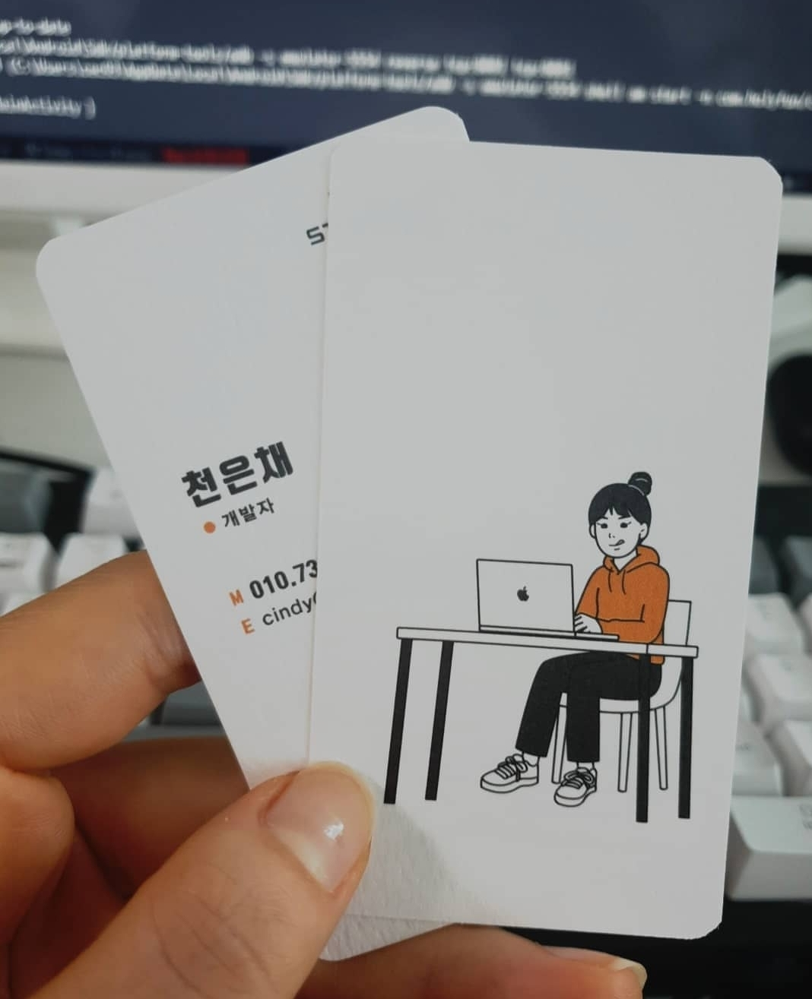
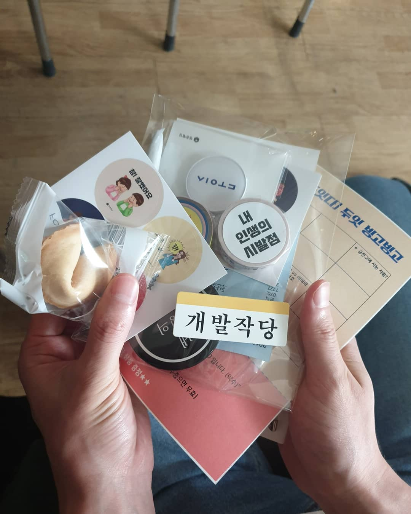
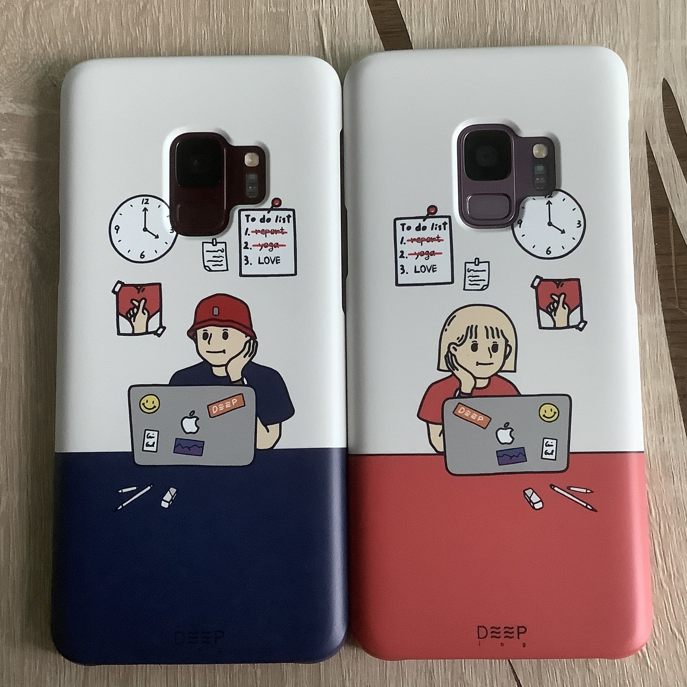

어느새 2020년😱 
시간이 빨리 흘러간다는 걸 체감하게 된다. 
2019년은 내가 전공을 바꾸고 개발자로서 첫 발을 내딘 해로서 개발자로서도 개인적으로도 아주 의미 있는 해였다!

# 1월 ~ 2월

## 🙋‍♀️ 직장인

나도 드디어 직장인이 되었다!😤 그동안 수많은 아르바이트를 해왔지만 뭔가 '취업'이라는 걸 준비해서 '취직'이 된 건 처음이라 너무 뜻깊었다. 
또 내 전공과는 아예 상반되는 '개발자'로 취직을 하다니 참 의미 있었다. 
애초에 문과였고, 개발자 == 공부 잘하는 사람이라고 생각해서 공부와 거리가 너무나도 먼 나는 평생 공부하는 직업을 가지지 못할 거라고 생각했었다. 
처음 해보는 개발에 점점 흥미를 가졌고 결국 직업까지 갖게 되었다. 정말 다사다난했지만 개발자로서 취업한 나에게 칭찬을 하고 싶다! 

비전공자에서 개발자가 되기까지의 비하인드는 따로 포스팅을 할 예정이다.

## 👩🏻‍💻 첫 번째 앱 런칭

나는 기획도 없는 스타트업으로 취업했다.
내가 그 회사의 첫 개발자였고, 첫 직원이었다. 
기획이 없는 회사라 설계부터 개발까지 심지어는 디자인까지 해야 하는 상황이었다.
취업 준비 중 3개의 회사에게 오퍼를 받았지만 그중 이 회사를 선택한 이유는 개발자로서 빠른 성장을 하고 싶어 선택했다. 
그 선택에 대해서는 2020년이 와서도 후회는 하지 않는다.

내가 오퍼 받은 날, K도 오퍼를 받았고 그렇게 회사 인원은 대표 1명 개발자 2명이 되었다. 
다시 본론으로 돌아와서 기획이 없는 스타트업이다 보니
출근 2일 만에 뭐 만들지 앱을 정하고 3일 만에 앱 개발을 시작했다.
K와 나는 둘 다 안드로이드로 취업했고, 우리는 안드로이드 출시를 목표로 카메라 앱을 만들었다.

혼자 개발을 해오다가 협업을 하는 과정이 매우 까다로웠고, git도 제대로 다룰 줄 몰랐던 상태, 그리고 K도 나와 같은 1년 차였다.
둘 다 처음이다 보니 우여곡절도 많았지만 4주 만에 개발을 끝내고 앱 런칭을 완료했다!

지금은 유지보수도 안 하는 그냥.. 흘러가는 앱이 돼버렸지만 다음에 기회 되면 싹 다 유지보수를 해서 ios까지 런칭하고 싶다.

## 👨‍👨‍👧‍👧 개발 스터디를 시작하다

나는 구청 홈페이지를 좋아한다. 
구민 사람들을 위해 운동, 강의뿐만 아니라 공모전(?) 같은 것도 열기 때문에 자주 들어가는 편이다. 
여김 없이 구청 홈페이지를 접속했더니 '청춘 삘딩'이라는 청춘 활동공간이라는 게 있었고 청년 지지 사업을 한다고 했다.
그중 DOIT COMMUNITY 가 눈에 띄었고 활동비도 지원한다는 소리에 주변에 같이 공부하던 개발자 친구들과 모임을 시작했다.

모임을 하면서 드는 생각은 더 성장하자, 더 발전하자 였다. 각자 다른 환경에 있는 사람들의 회사, 개발 이야기를 들어보면서 정말 많은 것을 배웠고 깨달았다! (개발 작당 forever~~🌟)

# 3월 ~ 4월

## 👩🏻‍💻 두 번째 앱 런칭

카메라 앱이 끝나고 새로운 기획이 생기고 엎어지고를 반복했다. 
그러다 react native에 대해 알게 되었고 앞으로 어떤 앱이든, react native로 개발하자는 의견이 확정됐다. 
기획이 엎어지는 과정 중
react native를 공부하기 위해서 개인적으로 앱을 만들어보기 시작했다. 
무엇을 만들까 하다가 항상 월경과 피임을 기록하는 앱은 있지만 구체적인 사랑 관계 기록하는 앱은 없어 내심 아쉬웠다.
아쉬웠던 경험을 토대로 앱을 만들기 시작했고 한 달 정도 소요돼서 앱을 런칭했다..!

항상 개발하면서 느끼는 거지만 개발 공부는 무언가를 만들어봐야 실력이 느는 것 같다! 
안드로이드와 헷갈렸던 react native에 대해서 점차 이해가 갔고
무슨 앱이든 react native로 만들 수 있겠다 라는 **자신감**도 더불어 생겨났다!
현재는 개인 사정으로 앱을 내린 상태지만 기능을 더 추가해서 다시 런칭할 계획이다

# 5월 ~ 7월

## 👩🏻‍💻 세 번째 앱 런칭

대표님 아는 분이 기독교 협회에 대표직을 맡고 있다고 하셨다.
그분께서 기독교 관련 앱을 만들고 싶어 했고 기획이 엎어지기를 반복하던 중 우선 외주라도 받아서 개발해보자!라는 의견으로 개발을 시작했다. 
앱 런칭을 2번 해봤지만 사용자가 활발하게 사용하는 앱을 만든 것은 처음이라 정말 배울게 많았던 시간이었다.
뿐만 아니라 처음 사용하는 기술들이 많았다. (lambda, amplify, AppSync, dynamoDB, graphql...) 
하..^^.. 기술 선정을 왜 저렇게 했는지 저 때의 K와 나의 용기에 박수를 쳐주고 싶다.
개발하는 내내 처음 겪는 에러와 생각지도 못한 경우의 수들이 우리를 괴롭혀왔다. 
하지만 그만큼 얻는 게 확실히 많았다. 
세 번째 앱 런칭을 하고서 꾸준히 유지보수와 기능 업데이트를 하는 나의 모습에 2019년 처음으로 내가 개발자 같다고 느꼈었다..!😤

# 10월

## 🧘‍♀️ 요가와 PT 시작

개발자를 준비하는 과정 ~ 취업 후에 살이 무려 15kg 이상이 쪘었다.
인생 최고 몸무게를 찍는 느낌이란..😂 
주변에서 살이 쪘다는 소리를 어찌나 많이 들었는지 귀에 딱지가 앉았다. 무엇보다 몸이 무거워진 만큼 무기력 증가, 예민 증가에 열정은 사라져서 개발 아웃풋까지 잘 안 나왔었다. 
아 정말 안 되겠다 싶어서 바로 집 앞에 헬스장을 등록했다. 평생 운동을 해본 적이 없던 터라 많이 걱정했지만 웬걸?..
나에게 PT와 요가가 너무 잘 맞았다. 운동이 재미있었다. 
요가는 심신이 지친 나에게 힐링이 돼주었고 사계절 내내 수족냉증 때문에 고생하던 나의 병을 단번에 고쳤다..!
PT 수업도 매번 할 때마다 숨이 턱에 차오를 만큼 힘들지만 운동이 끝난 후에는 매우 뿌듯했다. 
운동을 시작 한 후로 주변 사람들에게 전체적으로 좋아 보여~라는 말을 많이 들었다. 
운동을 하면 행복 증진, 자존감 향상, 생산력이 높아짐 등 여러 가지 좋은 이점이 있다고는 알았지만 하지도 않고 의심했었다. 
하지만 운동 후 효과를 톡톡히 본 사람으로서 앞으로 내 인생에서 **운동은 개발처럼 뺄 수 없는 동반자**가 되었다!

# 11월

## 👩🏻‍💻 네 번째 앱 런칭

개발 스터디를 하면서 7명 개발자들의 훌륭한 인프라에 대해서 항상 아쉬웠었다. 
나와 K 2명이서 협업한 경험밖에 없기 때문에 7명과 협업하면 어떨까 라는 의문이 있었고,
각자 다른 분야에서 개발을 하고 있지만 시간을 조금만 투자하면 앱 하나는 출시할 수 있지 않을까 싶었다. 
보통 격주로 그 주 개발했던 이야기, 토론을 반복해서 하는데
팀원들과 회의 후 간단한 초성게임, 주 평균 3시간 투자, 10주 후 런칭을 목표로 앱 개발을 시작했다. 

나는 프런트를 맞게 되었는데 오래간만에 하는 android에 처음 접하는 Kotlin, Jetpack, mvp패턴에 많이 당황했었다.
또 10주간 개발하면서 이 프로젝트가 주 업무는 아니다 보니 몇 주 후에는 소홀해질 수밖에 없었고,
몇몇 팀원들끼리 충돌도 있었다. 
결국 나 포함 4명이서 런칭을 목표로 했던 날에 모여 7시간을 개발하고 겨우 앱 출시를 했던 기억이 있다.

이번 앱 출시를 하면서 느꼈던 건, 역시 협업은 어렵구나..! 커뮤니케이션이 정말 중요하고 규칙을 정하는 게 중요하다는 것을 느꼈다.
하나부터 열까지 정하는 건 피곤한 일이지만, 정하지 않고 일을 진행하면 그 후에 오는 후폭풍이 더 크다는 것을 알게 됐다.

## 👩🏻‍💻 관리자 웹 배포

기독교 앱을 만들면서 협회에서 쓸 관리자 웹이 필요했었다.
웹은 react로 만들었고 확실히 react native로 개발경험이 있는 상태에서 react를 개발해보니까 러닝 커브가 매우 낮아 개발하기가 수월했다. 
내가 개발자 준비를 했을 때 웹을 만든 적이 있었는데 배포 시 ec2를 통해서 배포를 했었다. 
하지만 검색을 해보니 S3에 빌드 파일을 올려서 배포를 할 수 있다는 점을 알게 되었다.
보통 ec2를 통해 배포를 하게 되면 Apache나 nginx를 설치하고 이것저것 환경 세팅을 해줘야 하는 걸로 기억하는데
S3를 통한 배포는 그런 과정이 생략되어서 매우 편리했다!

# 12월

## 👩🏻‍💻 다섯 번째 앱 런칭

나에겐 남자 친구 S가 있다. S도 나와 똑같은 개발자이고 나보다 더 성장에 대한 열정이 가득한 사람이다. 
휴가가 8일 정도 남아있었는데 연말에 휴가 계획을 잡다가 어쩌다 보니 집에서 개발계획을 잡게 되었다..^^ 
24 ~ 27일에 우리는 휴가를 잡았고 크리스마스를 제외한 5일을 개발했다.

11월에 만든 초성 게임 아웃풋이 너무 아쉬웠고 (S도 같은 스터디) 무엇보다 술자리에서 하는 게임으로 타깃을 잡았는데 시간상 android만 개발을 해서 런칭을 했으니 같은 술자리에 참석한 ios 유저는 게임을 못하는.. 
무튼 우리는 그전에 아쉬웠던 점을 생각해서 개발환경부터, 기술까지 싹 다 바꿨다. 
하루 평균 14시간 동안 식사도 컴퓨터 앞에서 개발했던.. 
남들이 보면 미쳤다고 생각할 정도로 열심히 개발에 몰두했다.

현재 ios는 출시가 된 상태이고, android는 콘텐츠 심의과정에 걸려 출시까지 시간이 걸리고 있다

# 2019년 회고 끝!

내가 개발자로서 성장하고 있는 걸까🤔 라는 의문을 항상 가지고 산다.  
2019년을 돌이켜보니 5개의 앱과 1개의 웹을 만들었고 새로운 기술들도 많이 접해봤다.  
아직도 너무 부족한 게 많아 아쉬움이 많이 남지만 개발자로서 첫 해를 나름 열심히 보낸 것 같아 나에게 박수를 쳐주고 싶다 👏👏👏 
꾸준히 앞으로 나아가면 언젠가는 성장할 것이란 걸 알고 있기에 조급해하지 않고 천천히 나아가기로 마음먹었다..!
2020년도 파이팅!💪🏻
