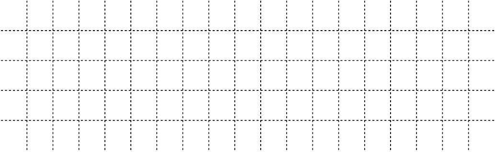
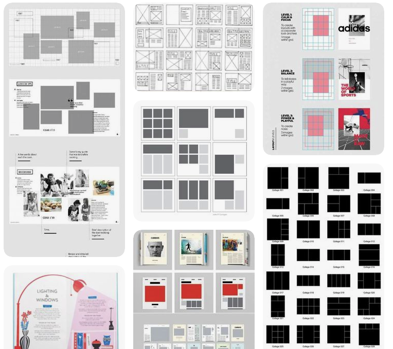
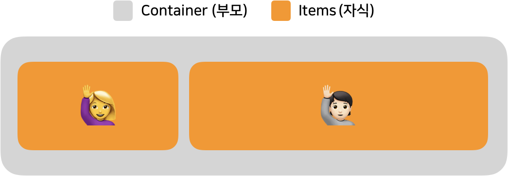
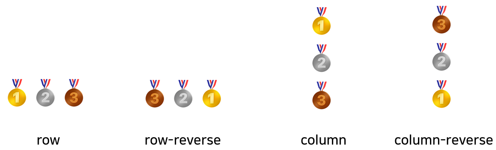
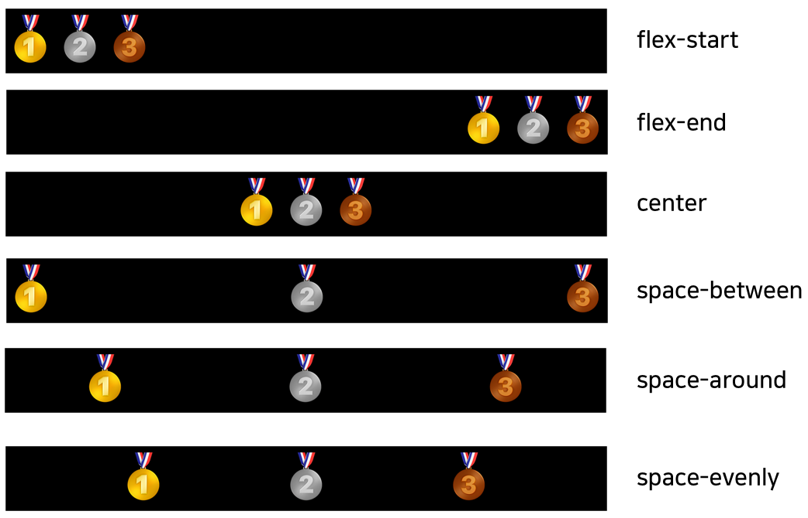
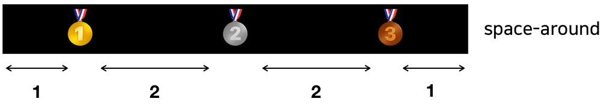
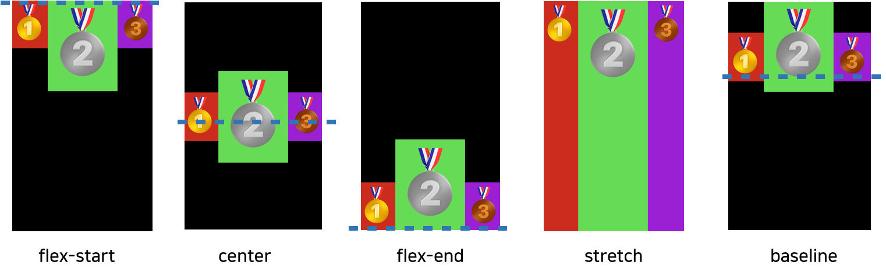
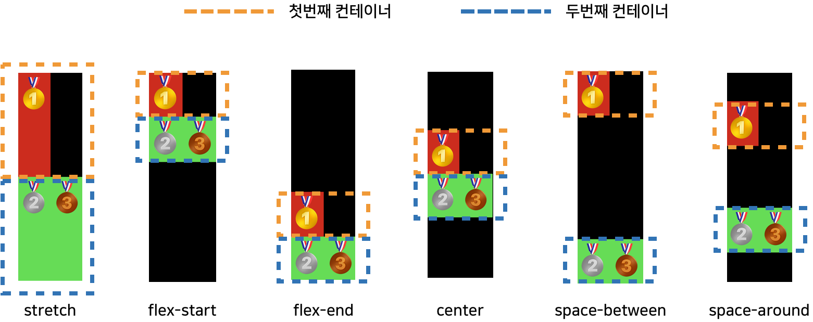

# Grid 사전적 의미

`1. 격자무늬 2. (금속·목재로 된) 격자판 3. (지도에서 위치를 나타내기 위한) 기준선망 (출처 : 네이버)`
<br>
<br>

그리드는 단어의 사전적 의미가 말해 주듯이 아래와 같은 격자 무늬를 말합니다. 창문, 원고지,바둑판 등 격자무늬는 우리 일상생활에서 많이 볼 수 있죠! 또 엑셀, 파워포인트의 '표' 와 같은 형태도 바로 그리드의 형태를 가지고 있습니다.


<br>
요즘 웹 페이지나 앱에서도 그리드 형태의 디자인을 많이 볼 수 있습니다!


# 부모와 자식 관계


`Grid`는 `Container - items (부모-자식)`구조로 이루어져 있습니다.<br>
위에 예시를 보면 부모와 두명의 자식이 있군요..! 이렇듯 Container 안에 한 개 이상의 item 이 포함될 수 있습니다.
Container 는 items 의 방향이나 정렬, 배치를 컨트롤 하고 items 는 item 내부에 있는 것들을 컨트롤 하게 됩니다.<br>

<br>

# React + Material UI Grid

`React` 에서 `Grid` 사용하는 방법을 알아 볼까요?<br>
Grid는 부모와 자식 구조로 이루어져 있다고 했습니다. 부모가 자식들을 자식이 자식 내부에 있는 것을 컨트롤 하기 위해서는 누가 Container 이며 item인지 정의를 해주어야 합니다.

```
import {Grid} from '@material-ui/core';

render() {
        return (
            <Grid container>
                <Grid item>아이템(1)</Grid>
                <Grid item>아이템(2)</Grid>
                <Grid item>아이템(3)</Grid>
            </Grid>
        );
    }
```

 <br>   


## 🤔 Container 없이 item은 못 쓸까?

네 container를 혼자 쓸 수 있지만, 하나 이상의 item은 혼자 못쓰게 됩니다.<br>
정확히 말하자면 쓸 수는 있지만 item들을 컨트롤 할 수 없게 되죠!<br>
item들을 컨트롤 할 수 있게 밖에서 container로 감싸 줘야 내부에 있는 item 들을 정렬, 배치를 컨트롤 할 수 있죠!<br>
하나의 item을 쓴다면 Grid container , item 를 정의 하는게 아닌 기본 `<Grid>..</Grid>` 를 사용하시면 됩니다.(_하지만 그렇게 되면 grid를 쓸 이유가..명분이 사라지죠!!_)

# 부모 (Container)

Container는 자기 안에 속한 items 를 컨트롤 할 수 있다고 했습니다.

items 을 컨트롤 해볼까요?

## **`direction`**

```
import {Grid} from '@material-ui/core';

render() {
        return (
            <Grid container direction={'방향컨트롤'}>
                <Grid item>🥇</Grid>
                <Grid item>🥈</Grid>
                <Grid item>🥉</Grid>
            </Grid>
        );
    }
}
```

**`direction`** 은 컨테이너 내부에 있는 아이템들의 방향을 설정할 때 쓰입니다.

`'row'| 'row-reverse'| 'column'| 'column-reverse'`


<br>
<br>

## `justify`

```
import {Grid} from '@material-ui/core';

render() {
        return (
            <Grid container justify={'정렬컨트롤'}>
                <Grid item>🥇</Grid>
                <Grid item>🥈</Grid>
                <Grid item>🥉</Grid>
            </Grid>
        );
    }
}
```

`**justify**` 은 컨테이너 내부에 있는 아이템들을 정렬 설정할 때 쓰입니다.

`'flex-start'| 'center'| 'flex-end'| 'space-between'| 'space-around'| 'space-evenly'`



## 🤔 space-around vs space-evenly

`**justify`\*\* 중 헷갈렸던 `space-around` 와 `space-evenly` 의 차이점을 알아 볼게요!

`space-around` 는 item 시작과 끝의 공간을 1로 배분한다면 item 사이에 있는 공간을 2로 배분을 하게 됩니다!



반면에 `space-evenly` 는 모든 item 공간을 균등하게 배분을 하는 차이가 있죠!


 <br>
 <br>

## `alignItems`

```
import {Grid} from '@material-ui/core';

render() {
        return (
           <Grid container alignItems={'수직정렬컨트롤'} style={styles.container}>
                <Grid item style={styles.item1}>
                    🥇
                </Grid>
                <Grid item style={styles.item2}>
                    🥈
                </Grid>
                <Grid item style={styles.item3}>
                    🥉
                </Grid>
            </Grid>
        );
    }
}
const Styles = makeStyles((theme: Theme) =>
    createStyles({
       container: {
           backgroundColor: '#000000', 
           height: '100px'
        },
       item1: {
           backgroundColor: '#DF0101
        },
       item2: {
           backgroundColor: '#01DF3A', 
           fontSize:30
        },
        item3: {
           backgroundColor: '#A901DB'
        },
    })
);
```

`**alignItems**` 은 컨테이너 내부에 있는 아이템들을 **수직 정렬** 설정할 때 쓰입니다.

`'flex-start'| 'center'| 'flex-end'| 'stretch'| 'baseline'`

이 설정은 기준선이 있다고 생각하시면 쉽습니다!



낯선 친구들만 설명하자면,

`stretch` 는 컨테이너 최대 높이에 맞게 정렬이 됩니다. 즉 컨테이너 높이를 꽉 채우도록 아이템을 늘리게 됩니다!

`baseline` 은 폰트의 크기 기준으로 수직 정렬이 됩니다. (제일 큰 폰트의 크기 기준으로 정렬)

저도 공부하기 전 `flex-start`와 `baseline`의 차이점을 헷갈려 했는데 밑에 저와 같은 분이 질문을 했더군요!
이해하기 쉽게 답변이 달렸어요! 참고 바랍니다!

[What's the difference between flex-start and baseline?](https://stackoverflow.com/questions/34606879/whats-the-difference-between-flex-start-and-baseline)
<br>
<br>

## `alignContent`

```
import {Grid} from '@material-ui/core';

render() {
        return (
          <Grid container alignContent={'컨테이너 정렬 컨트롤'} style={styles.container}>
                <Grid container>
                    <Grid item style={styles.item1}>
                        🥇
                    </Grid>
                </Grid>

                <Grid container>
                    <Grid item style={style.item2}>
                        🥈🥉
                    </Grid>
                </Grid>
            </Grid>
        );
    }
}

const Styles = makeStyles((theme: Theme) =>
    createStyles({
       container: {
           backgroundColor: '#000000', 
           height: '100px'
        },
       item1: {
           backgroundColor: '#DF0101
        },
       item2: {
           backgroundColor: '#01DF3A'
        },
    })
);
```

`alignContent` 는 **컨테이너 끼리**의 정렬을 할때 쓰입니다.

`'stretch'| 'center'| 'flex-start'| 'flex-end'| 'space-between'| 'space-around'`

이 설정 또한 컨테이너 마다 기준점이 있다고 생각하시면 쉽게 이해가 갑니다!


<br>
<br>

# 자식(item)

---

자식의 배치,정렬 또한 위에 부모에서 나열한 것 중에 `**alignContent`\*\* 제외한 모든 것이 동일하게 적용됩니다

# sandbox 로 Grid를 컨트롤 해보세요!

[Material Grid Demo](https://codesandbox.io/s/material-grid-demo-hdevq)

다음 포스팅은 `Grid`의 `lg` `md` `sm` `xl` `xs` 그리드 수에 대해 알아보겠습니다!

<br>
<br>
[참고 사이트] <br>
[Grid React component - Material-UI](https://material-ui.com/components/grid/#how-it-works) <br>
[Grid API - Material-UI](https://material-ui.com/api/grid/)<br>
[A Complete Guide to Flexbox | CSS-Tricks](https://css-tricks.com/snippets/css/a-guide-to-flexbox/)<br>
