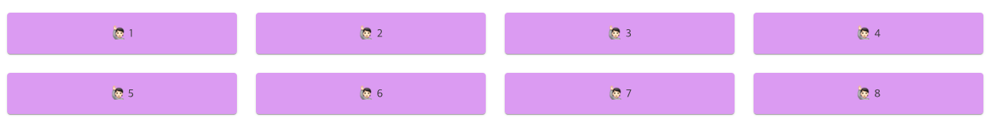

 1. [Material UI - Grid (1부)](https://cindy0306.github.io/dev/2019-year-in-review/index)

지난 포스팅에 이어, Grid 의 사이즈 속성에 대해 포스팅 해보겠습니다.

# 사이즈


<br>

우리는 옷을 구매할 때 디자인을 본 다음에 사이즈를 보고 삽니다.
이미 정해져 있는 옷의 사이즈를 보고 내게 맞는지 확인 후 구입을 하게 됩니다.
옷의 각기 다른 사이즈 처럼 UI를 보여주는 화면이 디바이스 별로 각기 다른 사이즈를 가지고 있어요!

<br>


<br>

이해하기 쉽게 임의로 사이즈를 넣어 놨어요! 보시는 것 처럼 아이폰보다 맥북이 맥북 보단 아이맥이 화면이 더 크죠!
`Gird` 의 `xs` `sm` `md` `lg` `xl` 는 디바이스 별로 사이즈가 다르기 때문에 보다 유연한 UI 를 제공하기 위해
미리 결정된 화면 크기의 범위에 따라 대응할 수 있는 속성을 제공하는 것입니다!

# xs sm md lg xl 

`Material-UI` `Breakpoints` 에서는 각 속성을 다음과 같이 정의 했습니다.
- **xs,** extra-small: 0px
- **sm,** small: 600px
- **md,** medium: 960px
- **lg,** large: 1280px
- **xl,** extra-large: 1920px


## 🤔 `Breakpoints`

`Breakpoints` 에 관해 잔깐 설명 하자면 미리 결정되어 있는 화면 크기의 범위를 말합니다.

즉, 특정 화면 크기에 들어올 경우 화면 레이아웃이 크기와 방향에 맞게 조정 되는 것이죠..!

더 자세한 이야기는 [material breakpoints](https://material.io/design/layout/responsive-layout-grid.html#breakpoints) 참고해주세요!

<br>
자 이제 코드로 볼까요?

```
import {Grid, Paper} from '@material-ui/core';

const Styles = makeStyles(theme => ({
  root: {
    padding: theme.spacing(3),
  },
  paper: {
    padding: theme.spacing(2),
    textAlign: 'center',
    background: '#E2A9F3'
  },
}));

render() {
const styles = Styles();
    return (
        <div className={styles.root}>
            <Grid container spacing={3}>
                <Grid item lg={3} md={4} sm={6} xs={12}>
                    <Paper className={styles.paper}>🙋🏻 1</Paper>
                </Grid>
                <Grid item lg={3} md={4} sm={6} xs={12}>
                    <Paper className={styles.paper}>🙋🏻 2</Paper>
                </Grid>
                <Grid item lg={3} md={4} sm={6} xs={12}>
                    <Paper className={styles.paper}>🙋🏻 3</Paper>
                </Grid>
                <Grid item lg={3} md={4} sm={6} xs={12}>
                    <Paper className={styles.paper}>🙋🏻 4</Paper>
                </Grid>
                <Grid item lg={3} md={4} sm={6} xs={12}>
                    <Paper className={styles.paper}>🙋🏻 5</Paper>
                </Grid>
                <Grid item lg={3} md={4} sm={6} xs={12}>
                    <Paper className={styles.paper}>🙋🏻 6</Paper>
                </Grid>
                <Grid item lg={3} md={4} sm={6} xs={12}>
                    <Paper className={styles.paper}>🙋🏻 7</Paper>
                </Grid>
                <Grid item lg={3} md={4} sm={6} xs={12}>
                    <Paper className={styles.paper}>🙋🏻 8</Paper>
                </Grid>
            </Grid>
        </div>
		
     );
};
```

<br>   

`<Grid item lg={3} md={4} sm={6} xs={12}>`

위와 같이 속성을 주었습니다. 각 속성에 특정 값을 넣으면 화면 너비에 해당하는 속성의 값으로 컴포넌트의 크기와 배치가 결정됩니다! 제가 설정한 속성을 해석하자면

`lg` (1280px~1920px) 범위의 화면 크기에서는 한 줄에 컴포넌트가 4개,

`md` (960px~1280px) 범위의 화면 크기에서는 한줄에 컴포넌트가 3개,

`sm` (600px~960px) 범위의 화면 크기에서는 한줄에 컴포넌트가 2개,

`xs` (0px~600px) 범위의 화면 크기에서는 한줄에 컴포넌트가 1개가 위치 하게 됩니다.

<br>  
밑에 결과 값을 보시죠

### `lg` 1280px 


### `md` 960px 


### `sm` 600px 


### `sx` 360px 


## 🤔 왜 lg={3} 이 값 그대로의 3개가 아닌 한 줄에 컴포넌트 4개 일까?
`<Grid item lg={3} md={4} sm={6} xs={12}>`
코드와 결과 값을 보면 특정 값인 채로 나오지 않죠..!

3 → 4 , 4 → 3, 6 → 2, 12 → 1 개가 나옵니다.

그 이유는 그리드의 열은 기본적으로 **총 12개의 열로 나눠져 있기 때문에** 그렇습니다.

컴포넌트의 넓이가 12일 경우 12개의 열을 차지하기 때문에 한 줄에 컴포넌트 1개가 들어 가게 됩니다.

넓이를 6로 지정 할 경우 12개의 열을 6, 6씩 차지 하기 때문에 한 줄에 2개가 들어가죠 😊

그리드가 총 12개의 열로 나눠져 있다고 생각하시면 왜 lg={3} 이 값 그대로의 3개가 아닌 4개인지 알 수 있습니다!

<br>
<br>
[참고 사이트] <br>
[Grid React component - Material-UI](https://www.notion.so/peopet/Material-UI-Grid-2-xs-sm-md-lg-xl-385c69a1f9f84933a5d9532deab26602#f177bf62058444e69a422b4afe9c2bf3) <br>
[Responsive layout grid](https://material.io/design/layout/responsive-layout-grid.html#breakpoints)<br>
